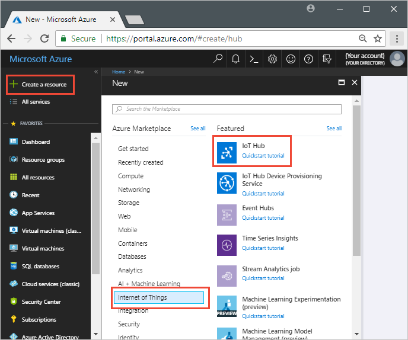
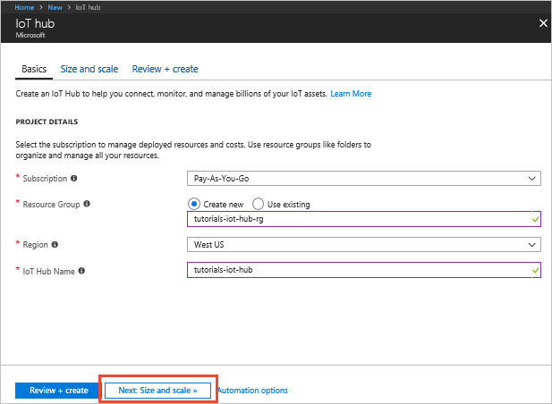
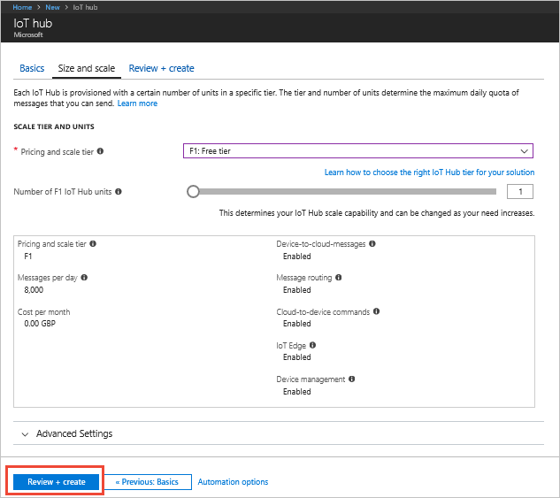
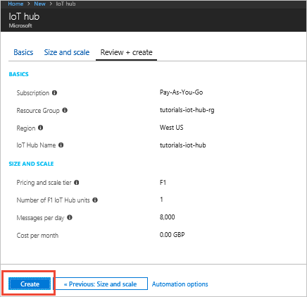
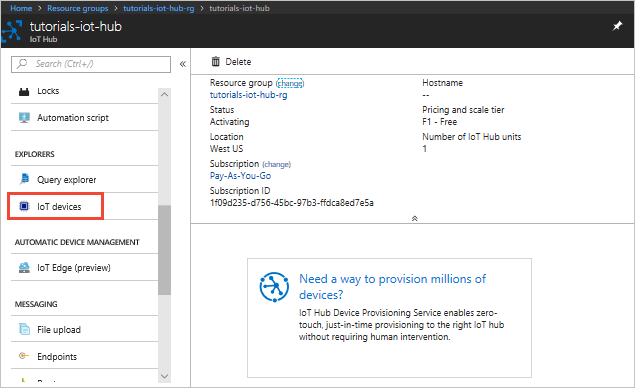
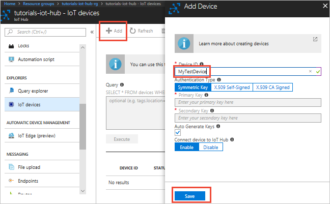
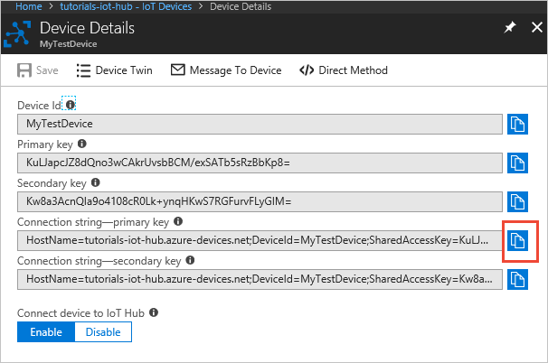
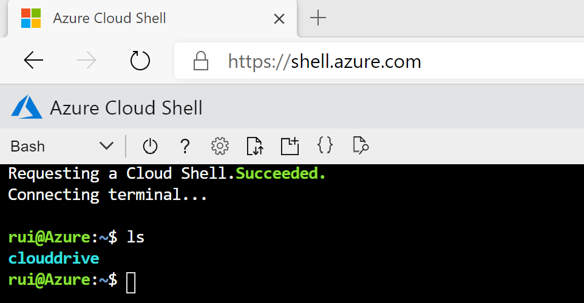
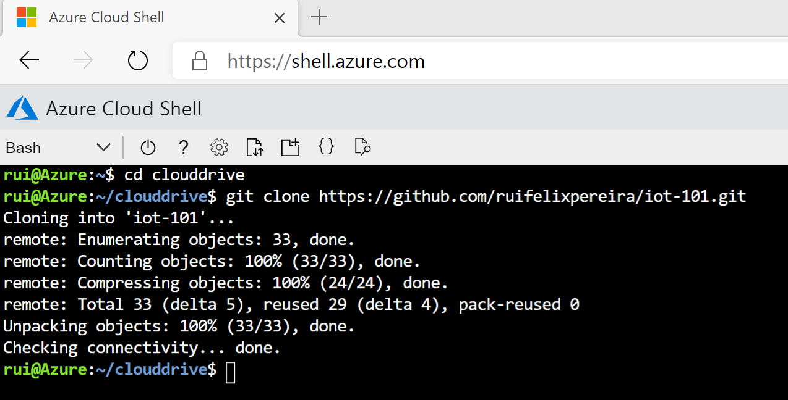

# Create IoT Hub, configure sample device and test connectivity

This tutorial guides you to create an Azure IoT Hub using the Azure portal, configure a sample device and test connectivity using a device simualtor.

## Create IoT Hub

1. Sign in to the [Azure portal](https://portal.azure.com).

2. Select **Create a resource** > **Internet of Things** > **IoT Hub**.

    

3. To create your free-tier IoT hub, use the values in the following tables:

    | Setting | Value |
    | ------- | ----- |
    | Subscription | Select your Azure subscription in the drop-down. |
    | Resource group | Create new. This tutorial uses the name **tutorials-iot-hub-rg**. |
    | Region | This tutorial uses **West US**. You can choose the region closest to you. |
    | Name | The following screenshot uses the name **tutorials-iot-hub**. You must choose your own unique name when you create your hub. |

    

    | Setting | Value |
    | ------- | ----- |
    | Pricing and scale tier | F1 Free. You can only have one free tier hub in a subscription. |
    | IoT Hub units | 1 |

    

4. Click **Create**. It can take several minutes for the hub to be created.

    

5. Make a note of the IoT hub name you chose. You use this value later in the tutorial.


## Configure Sample Device

1. In your IoT hub, navigate to the **IoT Devices** tool:



2. To register a new device, click **+ Add**, set **Device ID** to **MyTestDevice**, and click **Save**:



3. To retrieve the connection string for **MyTestDevice**, click on it in the list of devices and then copy the **Primary Connection String** value. The connection string includes the *shared access key* for the device.




## Run Device Simulator

To simulate **MyTestDevice** sending telemetry to your IoT hub, you are going to run a Node.js simulated device application that you can download [here](https://github.com/ruifelixpereira/iot-101/tree/master/labs/simulator).

You can use a terminal window on your development machine but you need to install Node.js version 8+ and Git as pre-requisites. To avoid having to prepare your development machine, let's use the Azure Cloud Shell environment.

1. Sign in to the [Azure Cloud Shell portal](https://shell.azure.com). If it's the first time running Cloud Shell, choose a Storage Account to store your files and use Bash shell.



2. Change to your **clouddrive** directory (which maps to your persistent storage account) and clone the GitHub repository with the simulated device application:

```cmd/sh
cd clouddrive
git clone https://github.com/ruifelixpereira/iot-101.git
```



3. Navigate to the **iot-101/labs/simulator** folder of the sample GitHub repositorory you downloaded, where the Node.js simulated device application resides.

4. In the terminal window, run the following commands to install the required libraries and rename the file **.env-to-customize** to **.env**.

```cmd/sh
npm install
mv .env-to-customize .env
```

5. Edit the file **.env** and replace the environment variable **IOTHUB_CONNECTION_STRING** value with the device connection string you made a note of when you added the device in the portal (Step 3. of the previous section). You can use the *vi* editor for editing this file.

6. In the terminal window, run the following command to run the simulated device.

```cmd/sh
node index.js
```

The terminal window displays information as it tries to connect to your hub and starts to send messages to your IoT Hub:


You've now successfully authenticated from a device using a device key generated by your IoT hub and sending test messages.


### Protocols

A device can use any of the following protocols to connect to your IoT hub:

| Protocol | Outbound port |
| --- | --- |
| MQTT |8883 |
| MQTT over WebSockets |443 |
| AMQP |5671 |
| AMQP over WebSockets |443 |
| HTTPS |443 |

If the outbound port is blocked by a firewall, the device can't connect:


## Check device-to-cloud connectivity

After a device connects, it typically tries to send telemetry to your IoT hub. This section shows you how you can verify that the telemetry sent by the device reaches your hub.

First, retrieve the current connection string for your simulated device using the following command:

```azurecli-interactive
az iot hub device-identity show-connection-string --device-id MyTestDevice --output table --hub-name {YourIoTHubName}
```

To run a simulated device that sends messages, navigate to the **iot-hub\Tutorials\ConnectivityTests** folder in the code you downloaded.

In the terminal window, run the following commands to install the required libraries and run the simulated device application:

```cmd/sh
npm install
node SimulatedDevice-3.js "{your device connection string}"
```

The terminal window displays information as it sends telemetry to your hub:


You can use **Metrics** in the portal to verify that the telemetry messages are reaching your IoT hub. Select your IoT hub in the **Resource** drop-down, select **Telemetry messages sent** as the metric, and set the time range to **Past hour**. The chart shows the aggregate count of messages sent by the simulated device:


It takes a few minutes for the metrics to become available after you start the simulated device.

## Check cloud-to-device connectivity

This section shows how you can make a test direct method call to a device to check cloud-to-device connectivity. You run a simulated device on your development machine to listen for direct method calls from your hub.

In a terminal window, use the following command to run the simulated device application:

```cmd/sh
node SimulatedDevice-3.js "{your device connection string}"
```

Use a CLI command to call a direct method on the device:

```azurecli-interactive
az iot hub invoke-device-method --device-id MyTestDevice --method-name TestMethod --timeout 10 --method-payload '{"key":"value"}' --hub-name {YourIoTHubName}
```

The simulated device prints a message to the console when it receives a direct method call:


When the simulated device successfully receives the direct method call, it sends an acknowledgement back to the hub:


## Check twin synchronization

Devices use twins to synchronize state between the device and the hub. In this section, you use CLI commands to send _desired properties_ to a device and read the _reported properties_ sent by the device.

The simulated device you use in this section sends reported properties to the hub whenever it starts up, and prints desired properties to the console whenever it receives them.

In a terminal window, use the following command to run the simulated device application:

```cmd/sh
node SimulatedDevice-3.js "{your device connection string}"
```

To verify that the hub received the reported properties from the device, use the following CLI command:

```azurecli-interactive
az iot hub device-twin show --device-id MyTestDevice --hub-name {YourIoTHubName}
```

In the output from the command, you can see the **devicelaststarted** property in the reported properties section. This property shows the date and time you last started the simulated device.


To verify that the hub can send desired property values to the device, use the following CLI command:

```azurecli-interactive
az iot hub device-twin update --set properties.desired='{"mydesiredproperty":"propertyvalue"}' --device-id MyTestDevice --hub-name {YourIoTHubName}
```

The simulated device prints a message when it receives a desired property update from the hub:


In addition to receiving desired property changes as they're made, the simulated device automatically checks for desired properties when it starts up.

## Clean up resources

If you don't need the IoT hub any longer, delete it and the resource group in the portal. To do so, select the **tutorials-iot-hub-rg** resource group that contains your IoT hub and click **Delete**.

## Next steps

In this tutorial, you've seen how to check your device keys, check device-to-cloud connectivity, check cloud-to-device connectivity, and check device twin synchronization. To learn more about how to monitor your IoT hub, visit the how-to article for IoT Hub monitoring.

> [!div class="nextstepaction"]
> [Monitor with diagnostics](iot-hub-monitor-resource-health.md)
