# Lab 02. Realtime Dashboards and Hot Path

This lab shows you how to add a realtime dashboard to your IoT solution using Power BI. Azure Stream Analytics enables you to take advantage of one of the leading business intelligence tools, [Microsoft Power BI](https://powerbi.com/). In this lab, you learn how to create business intelligence tools by using Power BI as an output for your Azure Stream Analytics jobs. You also learn how to create and use a real-time dashboard.

This Lab 02 continues from the previous [Lab 01. Connectivity and Cold Path](./lab01-connectivity-cold-path.md) tutorial. It builds on the workflow created in that tutorial and adds a Power BI output so that you can visualize temperature readings in real time. 

## Prerequisites

Before you start, make sure you have the following:

* An Azure account.
* An account for Power BI Pro. You can use a work account or a school account.
* A completed version of the [Lab 01. Connectivity and Cold Path](./lab01-connectivity-cold-path.md)  tutorial.

## Add Power BI output
In this tutorial, the output is sent to Azure Blob storage. In this section, you add an output that sends information to Power BI.

1. In the Azure portal, open the Streaming Analytics job that you created earlier. If you used the suggested name, the job is named `MyASAJob`. Ensure that the job is stopped otherwise you cannot edit it.

2. On the left menu, select **Outputs** under **Job topology**. Then, select **+ Add** and choose **Power BI** from the dropdown menu.

3. Select **+ Add** > **Power BI**. Then fill the form with the following details and select **Authorize**:

   |**Setting**  |**Suggested value**  |
   |---------|---------|
   |Output alias  |  PowerBIOutput  |
   |Dataset name  |   sa-dataset  |
   |Table name |  temperature-readings  |

   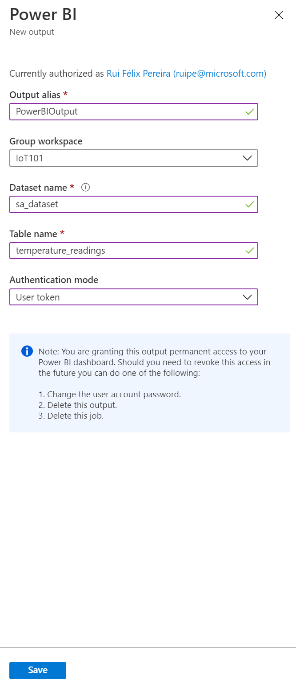

   > [!WARNING]
   > If Power BI has a dataset and table that have the same names as the ones that you specify in the Stream Analytics job, the existing ones are overwritten.
   > We recommend that you do not explicitly create this dataset and table in your Power BI account. They are automatically created when you start your Stream Analytics job and the job starts pumping output into Power BI. If your job query doesn't return any results, the dataset and table are not  created.
   >

4. When you select **Authorize**, a pop-up window opens and you are asked to provide credentials to authenticate to your Power BI account. Once the authorization is successful, **Save** the settings.

8. Click **Create**.

The dataset is created with the following settings:

* **defaultRetentionPolicy: BasicFIFO** - Data is FIFO, with a maximum of 200,000 rows.
* **defaultMode: pushStreaming** - The dataset supports both streaming tiles and traditional report-based visuals (also known as push).

Currently, you can't create datasets with other flags.

For more information about Power BI datasets, see the [Power BI REST API](https://msdn.microsoft.com/library/mt203562.aspx) reference.


## Write the query

1. Close the **Outputs** blade and return to the job blade.

2. Click the **Query** box. 

3. Add the following query, without removing the existing one. 

    >[!NOTE]
    >If you did not name the input `IoTHubInput` in the Lab 01. tutorial, substitute your name for `IoTHubInput` in the **FROM** clause of the query.

   ```SQL
   SELECT
       System.TimeStamp AS time,
       AVG(Temperature) as temperature, 
       COUNT(*) AS[eventCount]
   INTO
       PowerBIOutput
    FROM
       IoTHubInput
    GROUP BY
       time, 
       temperature,
       TumblingWindow(second, 10)
   ```

4. Click **Save**.

## Run the job

1. Make sure the Device Simulator is running.

2. Navigate to the **Overview** page for your Stream Analytics job and select **Start**.

    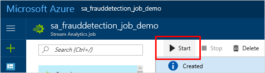

Your Streaming Analytics job starts looking for temperature readings in the incoming stream. The job also creates the dataset and table in Power BI and starts sending data about the temperature readings to them.


## Create the dashboard in Power BI

1. Go to [Powerbi.com](https://powerbi.com) and sign in with your work or school account. If the Stream Analytics job query outputs results, you see that your dataset is already created:

    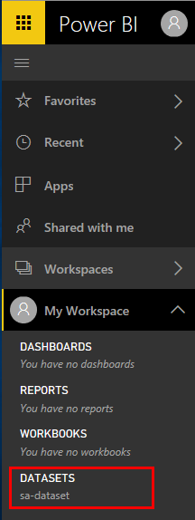

2. In your workspace, click **Create**.

    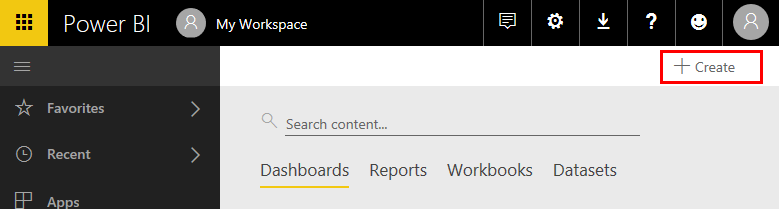

3. Create a new dashboard and name it `Temperature Readings`.

    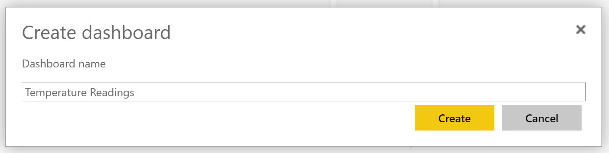

4. At the top of the window, click **Add tile**, select **CUSTOM STREAMING DATA**, and then click **Next**.

    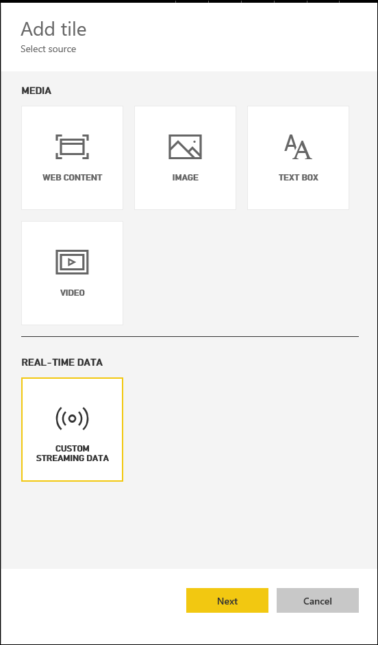

5. Under **YOUR DATASETS**, select your dataset and then click **Next**.

    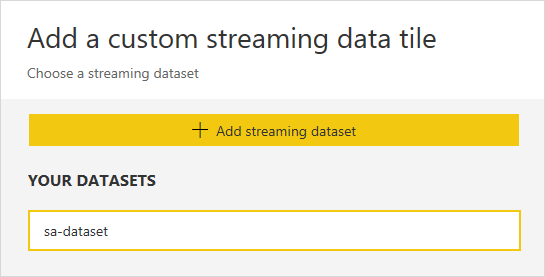

6. Under **Visualization Type**, select **Card**, and then in the **Fields** list, select **temperature**.

    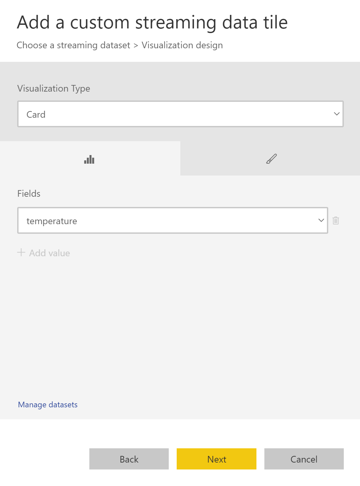

7. Click **Next**.

8. Fill in tile details like a title and subtitle.

    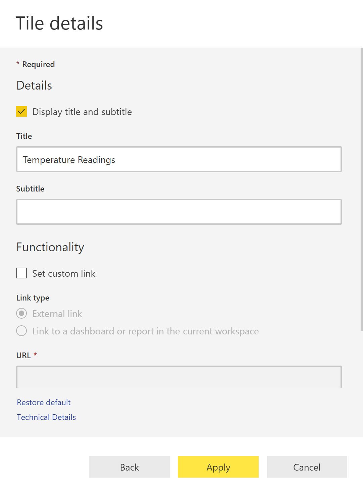

9. Click **Apply**.

    Now you have a temperature average!

    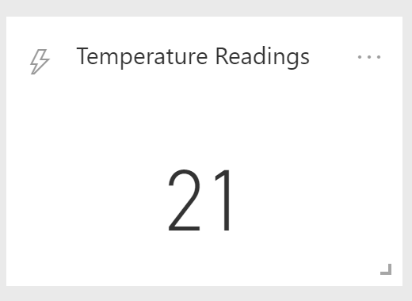

10. Follow the steps again to add a tile (starting with step 4). This time, do the following:

    * When you get to **Visualization Type**, select **Line chart**. 
    * Add an axis and select **time**. 
    * Add a value and select **temperature**.

      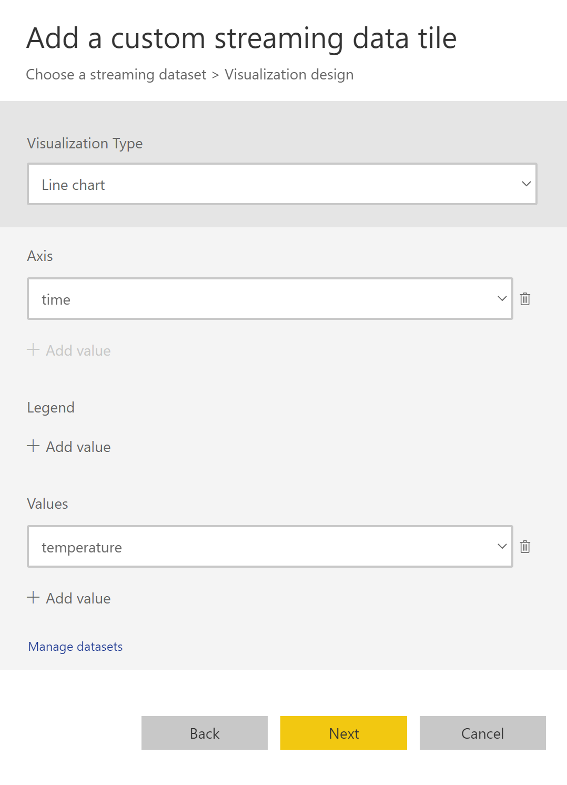

9. Click **Next**, add a title and subtitle, and click **Apply**.

     The Power BI dashboard now gives you two views of data about temperature readings in the streaming data.

     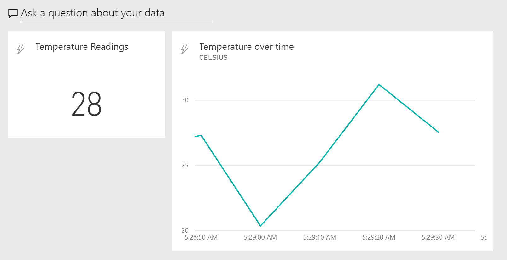


## Learn more about Power BI

This tutorial demonstrates how to create only a few kinds of visualizations for a dataset. Power BI can help you create other customer business intelligence tools for your organization. For more ideas, see the following resources:

* For another example of a Power BI dashboard, watch the [Getting Started with Power BI](https://youtu.be/L-Z_6P56aas?t=1m58s) video.
* For more information about configuring Streaming Analytics job output to Power BI and using Power BI groups, review the [Power BI](stream-analytics-define-outputs.md#power-bi) section of the [Stream Analytics outputs](stream-analytics-define-outputs.md) article. 
* For information about using Power BI generally, see [Dashboards in Power BI](https://powerbi.microsoft.com/documentation/powerbi-service-dashboards/).

