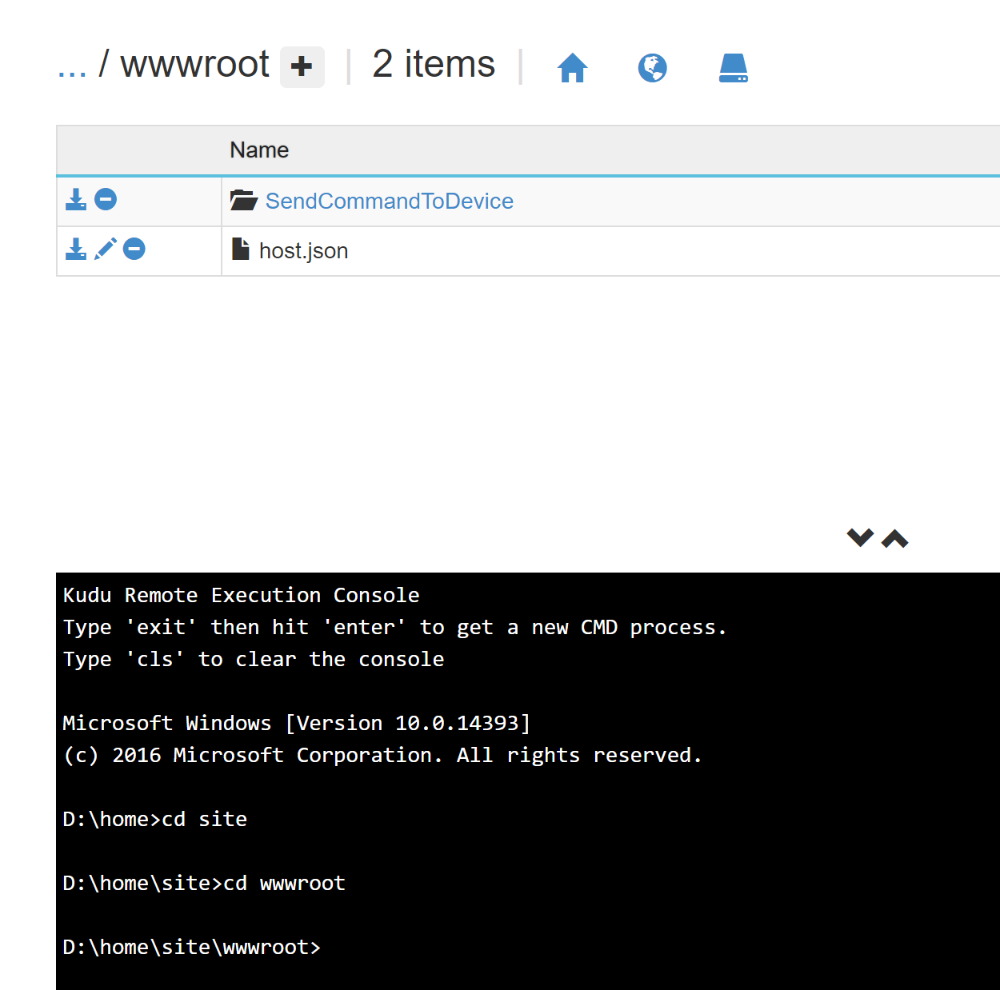

# Lab 03. Azure Functions actuator

This lab shows you how to add a realtime actuator to your IoT solution using Azure Functions. You can run Azure Functions from Azure Stream Analytics by configuring Functions as one of the output sinks to the Stream Analytics job. Functions are an event-driven, compute-on-demand experience that lets you implement code that is triggered by events occurring in Azure or third-party services. This ability of Functions to respond to triggers makes it a natural output to Stream Analytics jobs.

Stream Analytics invokes Functions through HTTP triggers. The Functions output adapter allows users to connect Functions to Stream Analytics, such that the events can be triggered based on Stream Analytics queries.

## Collect IotHub settings

In this lab, you create a function to send cloud-to-device messages through the IoT hub you created in the first Lab 01. To send cloud-to-device messages, your service needs the service connect permission. By default, every IoT Hub is created with a shared access policy named **service** that grants this permission.

To get the IoT Hub connection string for the service policy, follow these steps:

1. In the Azure portal, select Resource groups. Select the resource group where your hub is located, and then select your hub from the list of resources.

2. On the left-side pane of your IoT hub, select Shared access policies.

3. From the list of policies, select the service policy.

4. Under Shared access keys, select the copy icon for the Connection string -- primary key and save the value. Keep this value since it will be needed in this lab.


5. Also collect the name of your test device. If you followed the name given in the first Lab 01, the name is **MyTestDevice**.


## Create Function App

1. From the Azure portal menu or the **Home** page, select **Create a resource**.

2. In the **New** page, select **Compute** > **Function App**.

3. On the **Basics** page, use the function app settings as specified in the following table.

    | Setting      | Suggested value  | Description |
    | ------------ | ---------------- | ----------- |
    | **Subscription** | Your subscription | The subscription under which this new function app is created. |
    | **Resource Group** |  *myResourceGroup* | Name for the new resource group in which to create your function app. |
    | **Function App name** | Globally unique name | Name that identifies your new function app. Valid characters are `a-z` (case insensitive), `0-9`, and `-`.  |
    |**Publish**| Code | Option to publish code files or a Docker container. |
    | **Runtime stack** | Preferred language | Choose a runtime that supports your favorite function programming language. Choose **Node.js** for Javascript functions. |
    |**Version**| Version number | Choose the version of your installed runtime, like **12**.  |
    |**Region**| Preferred region | Choose a [region](https://azure.microsoft.com/regions/) near you or near other services your functions access. |

    

4. Select **Next : Hosting**. On the **Hosting** page, enter the following settings.

    | Setting      | Suggested value  | Description |
    | ------------ | ---------------- | ----------- |
    | **Storage account** |  Globally unique name |  Create a storage account used by your function app. Storage account names must be between 3 and 24 characters in length and can contain numbers and lowercase letters only. |
    |**Operating system**| Preferred operating system | An operating system is pre-selected for you based on your runtime stack selection. You can change but in this lab let's keep in **Windows**. |
    | **Plan** | **Consumption (Serverless)** | Hosting plan that defines how resources are allocated to your function app. In the default **Consumption** plan, resources are added dynamically as required by your functions. In this serverless hosting, you pay only for the time your functions run.  |

    

5. Select **Next : Monitoring**. On the **Monitoring** page, enter the following settings.

    | Setting      | Suggested value  | Description |
    | ------------ | ---------------- | ----------- |
    | **Application Insights** | Default | Creates an Application Insights resource of the same *App name* in the nearest supported region. By expanding this setting or selecting **Create new**, you can change the Application Insights name or choose a different region in an [Azure geography](https://azure.microsoft.com/global-infrastructure/geographies/) where you want to store your data. |

    

6. Select **Review + create** to review the app configuration selections.

7. On the **Review + create** page, review your settings, and then select **Create** to provision and deploy the function app.

8. Select the **Notifications** icon in the upper-right corner of the portal and watch for the **Deployment succeeded** message.

9. Select **Go to resource** to view your new function app. You can also select **Pin to dashboard**. Pinning makes it easier to return to this function app resource from your dashboard.

    


## Create an HTTP trigger function

1. From the left menu of the **Functions** window, select **Functions**, then select **Add** from the top menu.

   
 
2. From the **New Function** window, select **Http trigger**.

    

3. In the **New Function** window, enter the name **SendCommandToDevice** for **New Function**, or enter a new name. Choose **Function** from the **Authorization level** drop-down list, and then select **Create Function**.

   


## Replace function code

1. Go to your newly created function.

    


2. In your new HTTP trigger function, select **Code + Test** from the left menu.

    

3. Replace this code with the one provided in file **labs/actuator/function-template.js**, and replace the values of **{iot hub connection string}** and **{device id}** (lines 6 and 7) with the values collected previously in this lab.

    

4. From the left menu of the **Functions** window, select **Advanced Tools** under **Development Tools**, then select **Add** from the top menu.

   

5. Then select **Go**.

   

6. Choose **Debug console** and then **CMD** in the top menu, and then navigate to **site** and to **wwwroot**.

   

7. Create a new file **package.json** using the plus sign next to **wwwroot** on the top.

   

8. Edit the new file **package.json**, paste the contents provided in **labs/actuator/package.json** and save it. 

    

9. Finally, let's install the required Node.js packages by running:

    ```bash
    npm install
    ```

    

    Our function is now ready to be invoked by Stream analytics.


## Update the Stream Analytics job with the function as output

1. Open your Stream Analytics job on the Azure portal.  

2. Browse to your function, and select **Overview** > **Outputs** > **Add**. To add a new output, select **Azure Function** for the sink option. The Functions output adapter has the following properties:  

   |**Property name**|**Description**|
   |---|---|
   |Output alias| A user-friendly name that you use in the job's query to reference the output. |
   |Import option| You can use the function from the current subscription, or provide the settings manually if the function is located in another subscription. |
   |Function App| Name of your Functions app. |
   |Function| Name of the function in your Functions app (name of your run.csx function).|
   |Max Batch Size|Sets the maximum size for each output batch, which is sent to your function in bytes. By default, this value is set to 262,144 bytes (256 KB).|
   |Max Batch Count|Specifies the maximum number of events in each batch that is sent to the function. The default value is 100. This property is optional.|
   |Key|Allows you to use a function from another subscription. Provide the key value to access your function. This property is optional.|

3. Provide a name for the output alias. In this tutorial, it is named **FunctionActuatorOutput**, but you can use any name of your choice. Fill in other details.

    

4. Open your Stream Analytics job, and update the query by adding the following in the end. If you did not name your output sink **FunctionActuatorOutput**, remember to change it in the query.  

   ```sql
   SELECT *
   INTO FunctionActuatorOutput
   FROM IoTHubInput
   HAVING Temperature > 30
   ```

    

5. Start the Device Simulator and start start the Stream Analytics job.


## Check Device Simulator receiving messages

Afer starting Stream Analytics job, you can see some messages reaching the Device Simulator:


